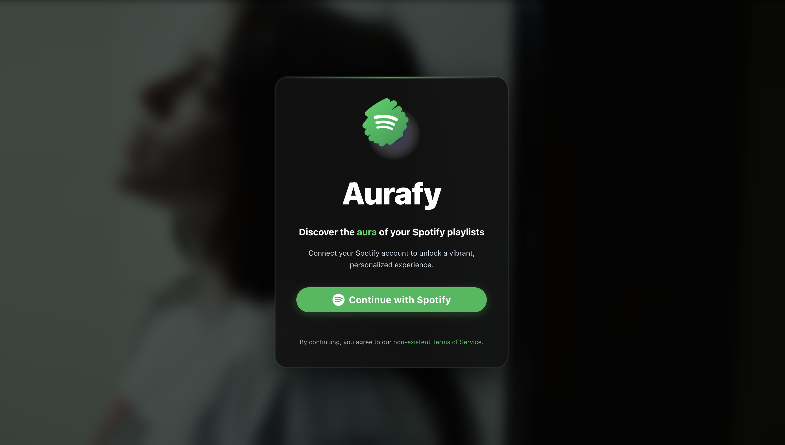
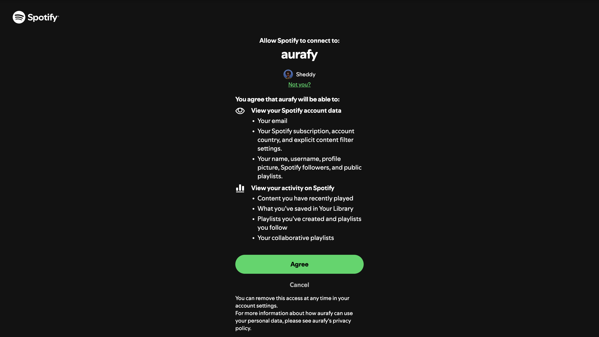
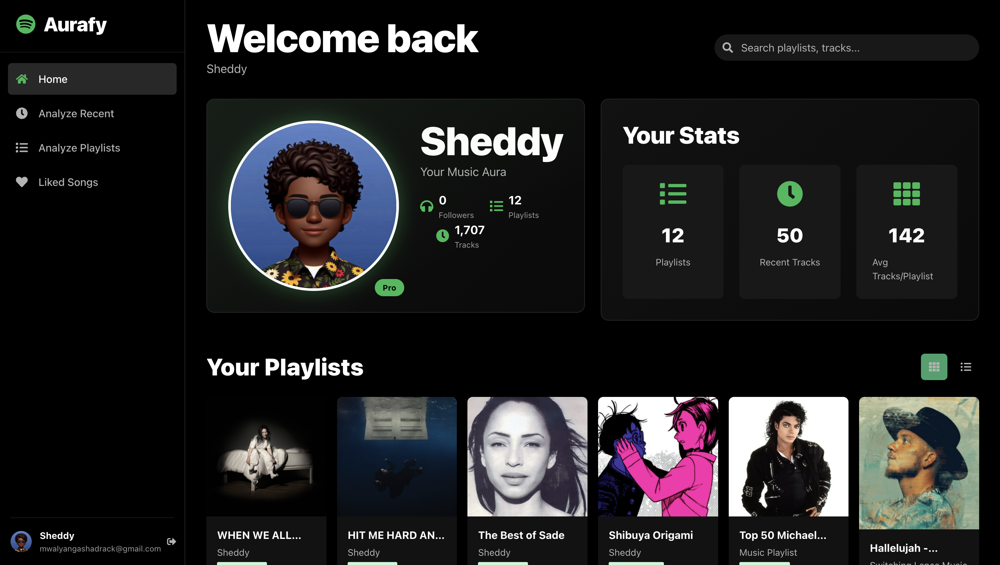

# Aurafy.

&descAlign=79&fontAlign=50&descAlignY=70&fontColor=f7f5f5)

<p align="center">Aurafy is web application that analyzes your music listening habits and assigns humorous "auras" based on audio features.</p>

  


<h3>Quick Links</h3>

<div align="left">
    <a href="mailto:mwalyangashadrack@gmail.com"></a>
    <a href="https://github.com/zuck30/aurafy"></a>
</div>

<br>
<a href="https://github.com/zuck30/aurafy"> 
</a>

<ul>
    <li>🔭 Currently analyzing musical patterns with <a href="https://developer.spotify.com/documentation/web-api">Spotify API</a></li>
    <li>👨‍💻 Built with React, FastAPI, and Python</li>
    <li>🎵 Transforms audio features into humorous personality insights</li>
</ul>

<h2 id=lang>Tech Stack</h2>

**Frontend**


**Backend**


**Tools & Platforms**


**API**


<h2> Quick Start</h2>

### Prerequisites

- Python 3.8+
- Node.js 14+
- Spotify Developer Account

### Installation

1. **Clone the repository**
   ```bash
   git clone https://github.com/zuck30/aurafy.git
   cd aurafy
   ```

2. **Set up the backend**
   ```bash
   pip install -r requirements.txt
   ```

3. **Set up the frontend**
   ```bash
   cd frontend
   npm install 
   ```

4. **Configure Spotify API for Local Development**
   - Create a Spotify Developer account at [https://developer.spotify.com/](https://developer.spotify.com/)
   - Register a new application.
   - In the app settings, add `http://127.0.0.1:8000/api/callback` as a redirect URI.
   - For local development, you can leave the default `SPOTIFY_CLIENT_ID` and `SPOTIFY_CLIENT_SECRET` in `netlify/functions/api/api.py` or replace them with your own.

5. **Run the application**
   - Start the development server:
     ```bash
     netlify dev
     ```
   This will start both the frontend and the backend services.

6. **Open your browser**
   Navigate to the URL provided by `netlify dev` (usually [http://localhost:8888](http://localhost:8888)).

## Deploying to Netlify

This project is configured for easy deployment to Netlify.

1.  **Fork this repository.**

2.  **Create a new project on Netlify** and connect it to your forked repository.

3.  **Configure Environment Variables:** In your Netlify project settings, add the following environment variables:

    *   `URL`: The full URL of your Netlify deployment (e.g., `https://your-app-name.netlify.app`). This is a built-in Netlify environment variable, so you just need to reference it.
    *   `FRONTEND_URL`: The same URL as `URL`.
    *   `SPOTIFY_CLIENT_ID`: Your Spotify application's client ID.
    *   `SPOTIFY_CLIENT_SECRET`: Your Spotify application's client secret.
    *   `PYTHON_VERSION`: Set this to the Python version you want to use, e.g., `3.8`.

4.  **Update Spotify Redirect URI:** In your Spotify application settings, add the following redirect URI:

    ```
    <YOUR_NETLIFY_URL>/api/callback
    ```

    Replace `<YOUR_NETLIFY_URL>` with your Netlify deployment URL.

5.  **Deploy!** Netlify will automatically build and deploy your application using the `netlify.toml` configuration.

 ### Aurafy overview
<h2>The Login page</h2>


<h2>The spotify authentication page.</h2>



<h2>Main dashboard</h2>



<h2>Recently played.</h2>


<h2> TODO: </h2>
<h3>Write better algorithm for the auras.</h3>

- **The Pogo Sticking Toddler**: High energy + high danceability
- **The Contemplative Emo Poet**: Low valence + high acousticness  
- **The Anxious Hummingbird**: High tempo + low energy
- **The Euphoric Clubber**: High energy + high positivity
- **The Moody Vampire**: Dark and atmospheric
- **The Chill Beach Bum**: Acoustic, positive, and relaxed

<h2> Responsive Design</h2>

The application is optimized for all device sizes:
- Mobile phones (320px and up)
- Tablets (768px and up)
- Laptops (1024px and up)
- Large screens (1200px and up)

<h2> Support the Project</h2>
<p>
    <a href="https://www.buymeacoffee.com/zuck30" target="_blank"></a>
</p>


## License

This project is licensed under the MIT License, see the [LICENSE.md](LICENSE.md) file for details.

## Support

If you have any questions or issues, please open an issue on GitHub or contact us at mwalyangashadrack@gmail.com

## Enjoy!

We hope you have fun discovering your musical aura! Share your results with friends and compare your musical personalities.

---

**Note**: This app is designed for entertainment purposes only. The "auras" are not scientifically validated assessments of personality or mood.